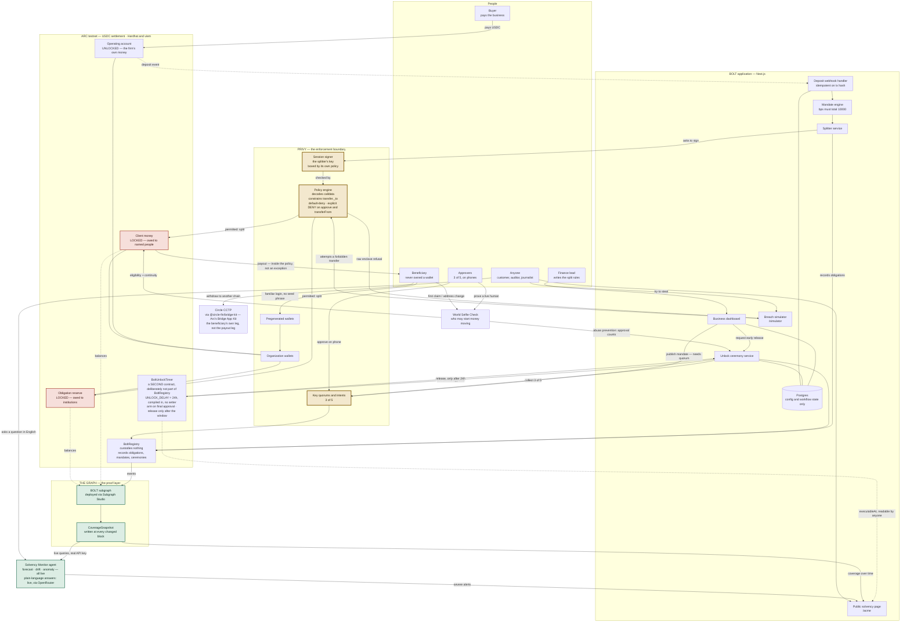
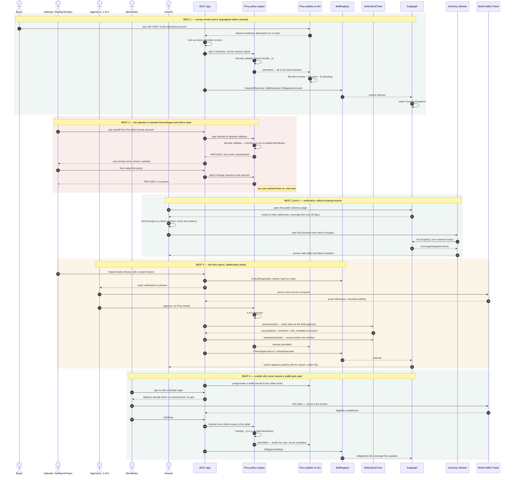
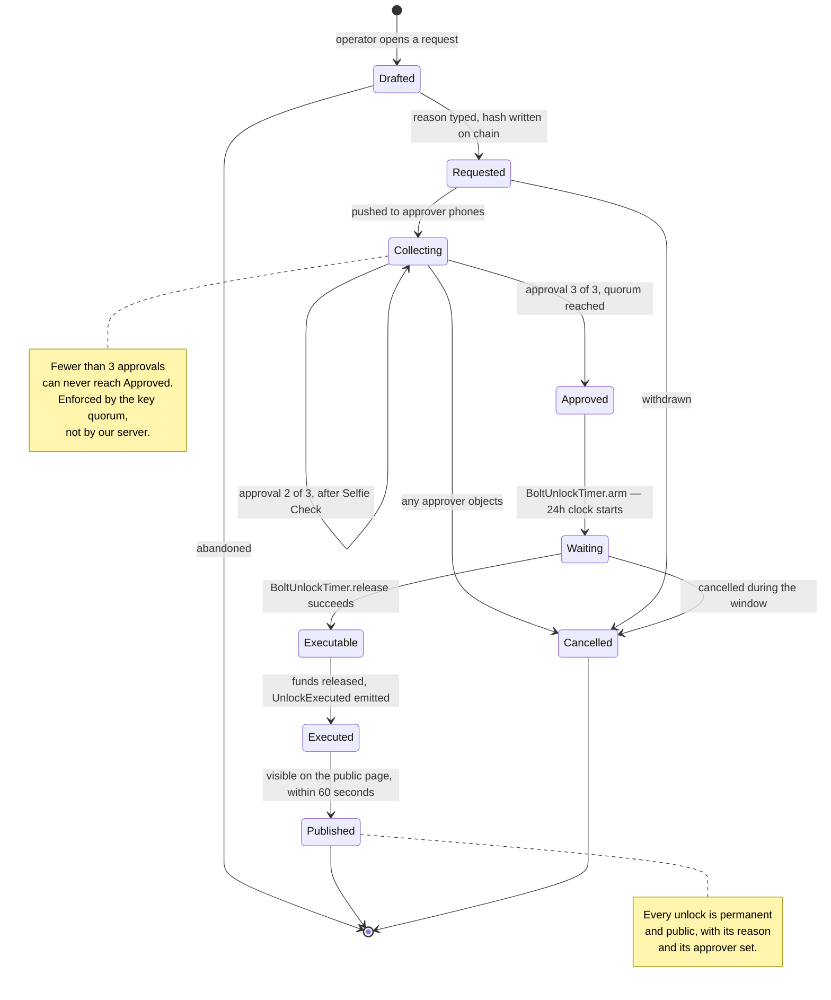

# Architecture

**BOLT** — **B**eneficiary-**O**nly **L**edger **T**ransfers.

## Why Mermaid rather than UML

Mermaid, for four practical reasons:

1. **It renders where the diagrams live.** GitHub renders Mermaid natively in Markdown, so `README.md` and this file show the real picture to a judge who never clones the repo. PlantUML needs a server or a build step, and a diagram nobody renders is a diagram nobody reads.
2. **It is version-controlled text.** Diffs are reviewable. A PNG exported from a UML tool goes stale the first time the design changes and nobody notices.
3. **The two diagrams we actually need are Mermaid's strongest forms** — a flowchart for the system and a `sequenceDiagram` for the flows. We are not modelling class hierarchies or inheritance, which is where UML earns its complexity.
4. **Zero tooling.** No install, no plugin, no export step, during a week where every hour matters.

---

## 1. System architecture

The thing to read first: the **Privy box is a boundary, not a service**. Everything above it can be compromised — our servers, our database, our dashboard — and the locked accounts still cannot pay an outsider, because the refusal happens inside the enclave before a signing key exists.

### Reading it in one paragraph

A buyer pays into the **operating account**, the only account the business can freely spend from. A Privy webhook fires; the mandate engine works out the split; the splitter asks a **session signer** to move funds into the locked accounts — and that signer is itself boxed by a policy limiting it to intra-business transfers, so a compromised splitter cannot pay an outsider either. Every obligation, mandate and ceremony is recorded to `BoltRegistry`, which holds no money and exists only so the numbers can be recomputed from chain data instead of from our database. The **subgraph** indexes those events alongside real USDC balances and writes a `CoverageSnapshot` whenever anything changes — that series is what draws the coverage line and what the **Monitor** reasons over. Releasing locked money early goes through a key quorum, a live-human check and a timer, never through application code — and the timer is its own contract, `BoltUnlockTimer`, rather than a `require` inside `BoltRegistry`, because changing `BoltRegistry` would mean a new address, a new manifest and the loss of every block of coverage history already indexed. **Privy constrains where money may go; World constrains who may start it moving** — two independent gates on the only two exits from a locked account.

Two things the picture cannot show, so they are said here. Everything above runs on **Arc testnet**; no part of it is deployed to a mainnet. And the World box is the one place where the *positive* path has not been exercised end to end — the credentials, the bridge request and the refusal path are live, but no human has completed a Selfie Check in this build, because there is no way to do so without a physical device. Both are stated at length in the README rather than left to be discovered.

---

## 2. Sequence — the full lifecycle

This is also the demo, beat for beat. Read it as the user flow: money arrives, gets segregated, someone tries to steal it and fails, a legitimate release happens the slow way, and a beneficiary who has never owned a wallet gets paid.

### The one line to take from it

Beat 2 and beat 6 touch the **same locked account**. In one it refuses, in the other it pays. The difference is not who asked, or how senior they were, or what our application decided — it is **whether the decoded recipient is a permitted payee**. That check happens in the same place both times, and our code is not in the room for it.

---

## 3. The unlock ceremony, as states

The only path by which locked money moves early. Every transition is either quorum-enforced or time-enforced; none is enforced by application logic.

---

## 4. Data model in brief

| Where | Holds | Trust |
|---|---|---|
| **Privy policies** | The rules about where money may go | The enforcement. Nothing above it can override it. |
| **Arc / USDC** | The money itself | Chain state. Independently verifiable. |
| **BoltRegistry** | Obligations, mandate versions, ceremonies, refusal-worthy facts | Append-only. Written by the splitter, so it is trusted *for accrual* — see the honesty note below. |
| **BoltUnlockTimer** | One `Timer{armedAt, executableAt, released}` per unlock id | A separate contract. `UNLOCK_DELAY` is a compiled-in constant with no setter and no owner override, so the delay is a public commitment rather than a policy we administer. |
| **Subgraph** | Everything above, joined and time-indexed | Derived. Recomputable by anyone from chain data. |
| **Postgres** | Config, drafts, workflow state, stored refusals | Convenience only. **No figure on the public page comes from here.** |

The subgraph's entity set, as deployed: `Business`, `Account`, `PolicyRotation`, `Mandate`, `Deposit`, `Split`, `Obligation`, `ObligationSettlement`, `Unlock`, `Approval`, `RecorderChange`, `UsdcTransfer`, `ClassPosition`, `CoverageSnapshot`. Three of those were not in the original plan and earn their place: `UsdcTransfer` indexes real USDC `Transfer` logs to and from registered accounts, so *held* is chain-derived rather than reported; `ClassPosition` carries owed-versus-held per account class; and `ObligationSettlement` separates settlement events from the obligations they close. `CoverageSnapshot` is still what draws the line in FR-6.4 and what the Monitor reasons over.

### The honest limitation

`BoltRegistry` records what the splitter reports as owed, so a compromised backend could under-report an obligation and make coverage look better than it is. What it *cannot* do: drain a locked account (policy, not server logic), change split ratios (quorum-governed), or hide the discrepancy — because the recorded obligation should equal `deposit × mandate ratio`, and the Monitor's drift check (FR-7.3) exists precisely to catch that divergence.

We state this in the README rather than hoping nobody asks.

---

## 5. Deployment

| Component | Runs on |
|---|---|
| `apps/web` | Vercel — dashboard, public page, API routes, webhook receiver |
| `apps/monitor` | A long-running host, or a cron loop plus a public endpoint for the question interface |
| `contracts` | Hardhat + viem. **Arc testnet** — both `BoltRegistry` and `BoltUnlockTimer`. See the note below on mainnet. |
| `subgraph` | Subgraph Studio |
| Postgres | Any managed instance |

**On Arc mainnet.** Nothing is deployed to it, and nothing can be: `arc-docs` lists Private Mainnet and Public Mainnet as *Upcoming* and says mainnet endpoints and parameters are published separately when available (re-checked 2026-09-11). The `arcMainnet` Hardhat network and `pnpm contracts:deploy:mainnet` exist and were exercised end to end — a real deploy transaction and receipt, using testnet parameters through the mainnet entry, to prove the path rather than assert it. With `ARC_MAINNET_RPC_URL` / `ARC_MAINNET_CHAIN_ID` unset the script exits 1 instead of quietly deploying somewhere unintended. Evidence: `docs/evidence/phase9-arc-mainnet-readiness.json`.

Webhook delivery needs a public URL, so tunnel it in local development rather than polling — the sub-30-second split in FR-3.7 is a demo beat, and polling makes it feel slow.
